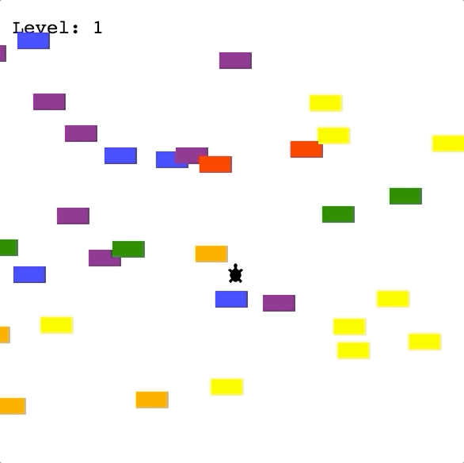
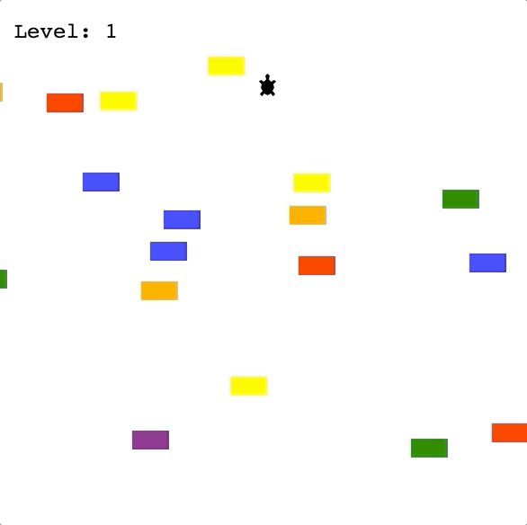
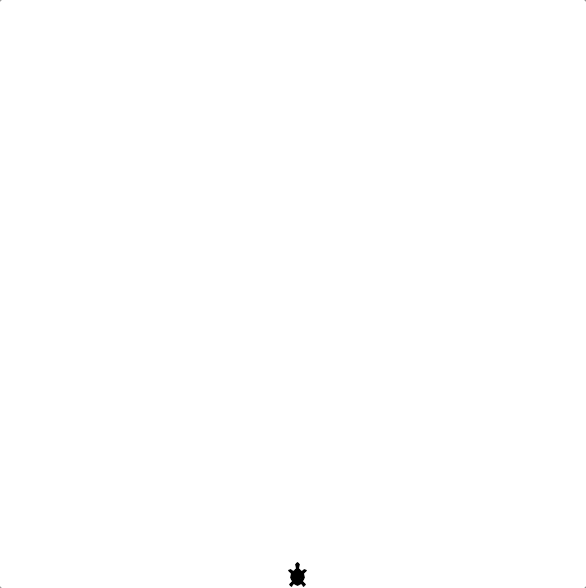
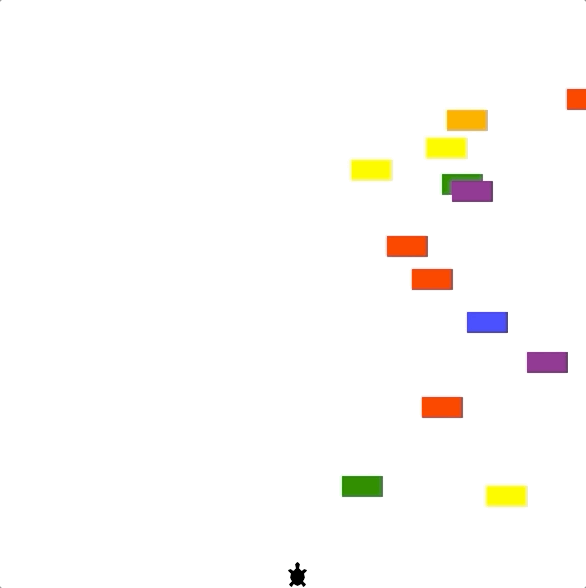
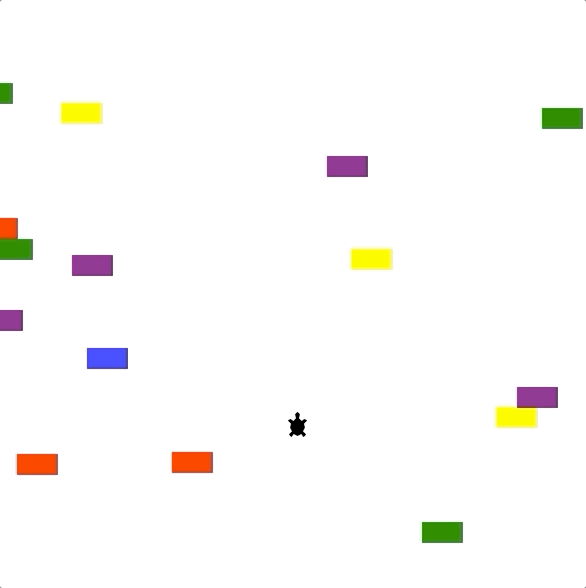
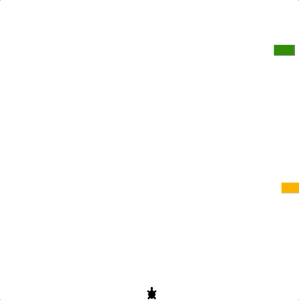
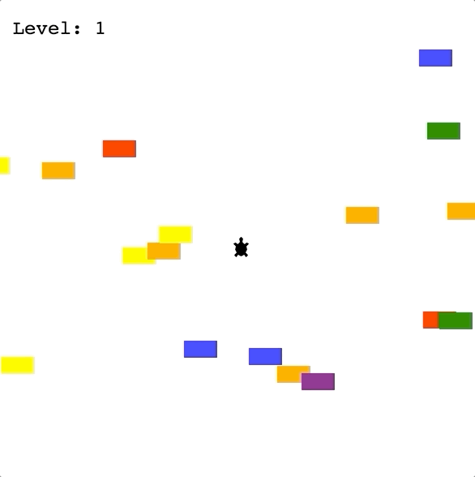

Turtle crossing game 
How it works: 
1. A turtle moves forwards when you press the "Up" key. It can only move forwards, not back, left or right. 

2. Cars are randomly generated along the y-axis and will move from the right edge of the screen to the left edge.

3. When the turtle hits the top edge of the screen, it moves back to the original position and the player levels up. On the next level, the car speed increases.

4. When the turtle collides with a car, it's game over and everything stops.

Step 2 - Break down the Problem

Create a turtle player that starts at the bottom of the screen and listen for the "Up" keypress to move the turtle north.

Create cars that are 20px high by 40px wide that are randomly generated along the y-axis and move to the left edge of the screen. No cars should be generated in the top and bottom 50px of the screen (think of it as a safe zone for our little turtle)

Detect when the turtle player collides with a car and stop the game if this happens.

Detect when the turtle player has reached the top edge of the screen (i.e., reached the FINISH_LINE_Y). When this happens, return the turtle to the starting position and increase the speed of the cars.

Create a scoreboard that keeps track of which level the user is on. Every time the turtle player does a successful crossing, the level should increase. When the turtle hits a car, GAME OVER should be displayed in the centre.

